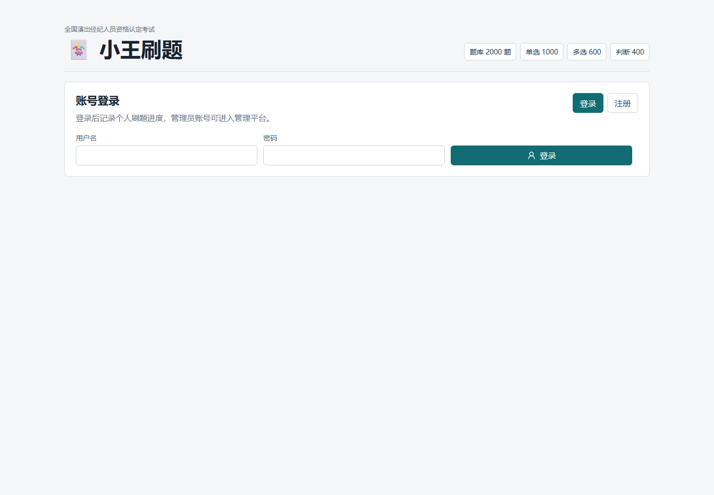
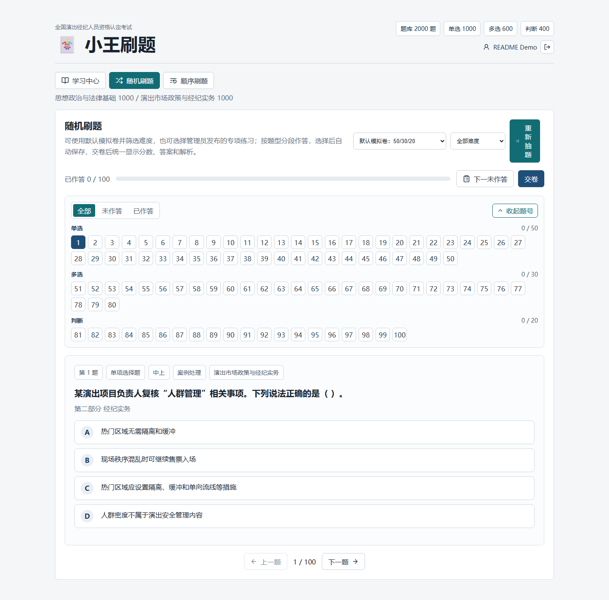
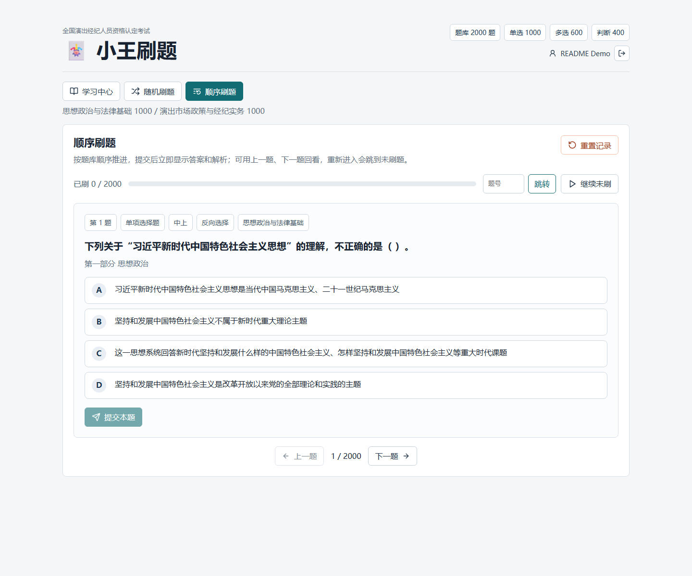
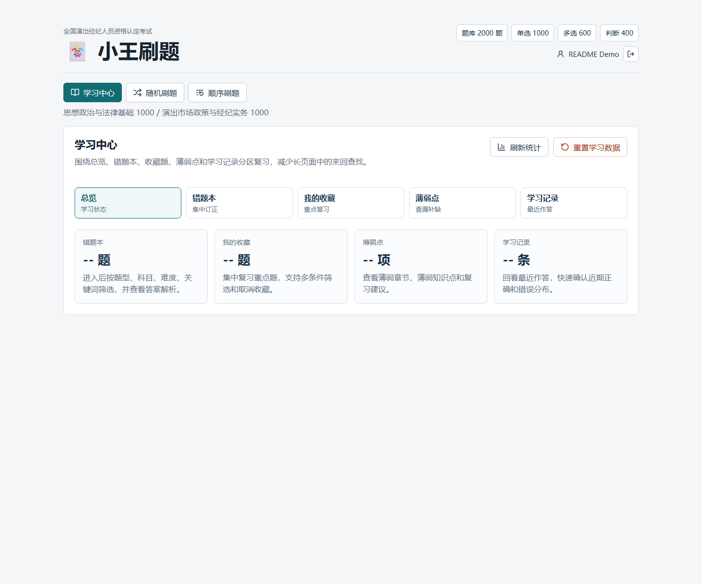
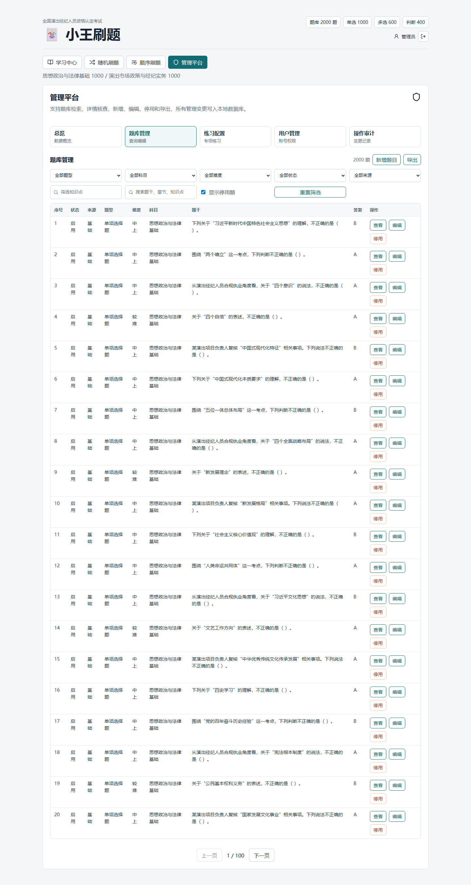

# XiaoWang Practice

XiaoWang Practice is a local-first question practice application built with React, Vite, FastAPI, and SQLite. It is designed for personal study, small-team question banks, and lightweight internal training workflows where the application code can be shared publicly while the real question bank remains private.

This repository contains the practice tool only. It does not include the private 2,000-question bank used in the screenshots. The public repository ships with a tiny demo bank at `data/question_bank.sample.json` so the application can be cloned, installed, and run immediately.

## Table Of Contents

- [Screenshots](#screenshots)
- [What This App Does](#what-this-app-does)
- [Architecture](#architecture)
- [Tech Stack](#tech-stack)
- [Quick Start](#quick-start)
- [Default Accounts](#default-accounts)
- [Question Bank Data](#question-bank-data)
- [Project Structure](#project-structure)
- [Common Commands](#common-commands)
- [Local Production Run](#local-production-run)
- [Backup And Restore](#backup-and-restore)
- [Development Checks](#development-checks)
- [Troubleshooting](#troubleshooting)
- [Open-Source Boundary](#open-source-boundary)
- [License](#license)

## Screenshots

The screenshots below are captured from a production-scale local dataset to show the full interface, real practice flow, and administration screens. The repository still does not include the private question-bank files themselves.

### Login



### Random Practice



### Sequential Practice



### Learning Center



### Admin Panel



## What This App Does

### Account System

- User registration, login, logout, and token-based sessions.
- Two roles: regular user and administrator.
- Default local accounts for first-time evaluation.
- User state stored in local SQLite.

### Random Practice

- Draws questions by type: single-choice, multiple-choice, and true/false.
- Supports difficulty filtering.
- Supports administrator-published practice sets.
- Keeps answers in a form-like draft before final submission.
- Allows users to move backward and change previous answers before submitting the full paper.
- Single-choice and true/false questions can auto-advance after first selection.
- Multiple-choice questions require manual navigation to avoid accidental submission.
- Final submission shows score, answers, explanations, and per-type summary.

### Sequential Practice

- Walks through the question bank in order.
- Supports previous/next navigation.
- Supports jumping to a specific question number.
- Tracks practiced questions.
- Can continue from the next unpracticed question.
- Supports resetting sequential practice progress.

### Learning Center

- Overview of current study progress.
- Wrong-question review.
- Favorites list.
- Weak-area review.
- Recent answer history.
- Reset button for learning data.
- Secondary navigation so wrong questions, favorites, weak areas, and history do not crowd a single long page.

### Admin Panel

Administrators can manage the local question-bank layer and users:

- Dashboard overview.
- Question filtering by type, subject, difficulty, status, origin, knowledge point, and keyword.
- Question creation, editing, disabling, and export.
- Practice set creation and publishing.
- User management: role switching, enable/disable, password reset.
- Audit logs for key administrative operations.

## Architecture

The application is intentionally simple:

```text
Browser
  |
  | HTTP / JSON
  v
FastAPI backend
  |
  | reads base question JSON
  | writes runtime state
  v
SQLite + local data files
```

Important design points:

- The base question bank is read from JSON at backend startup.
- Runtime state is stored in SQLite.
- User answers, favorites, wrong-question status, sessions, users, custom questions, practice sets, and audit logs are stored locally.
- The open-source repository excludes private question banks and runtime state.
- The backend can serve the built frontend in local production mode.

## Tech Stack

| Layer | Technology |
| --- | --- |
| Frontend | React 19, Vite 6, lucide-react |
| Backend | FastAPI, Pydantic, Uvicorn |
| Runtime database | SQLite |
| Question-bank format | JSON |
| Package managers | npm, pip |
| Local production mode | Vite build served by FastAPI |

## Quick Start

The commands below use Windows PowerShell.

### 1. Clone The Repository

```powershell
git clone https://github.com/versev999/XiaoWang-Tiku.git
cd XiaoWang-Tiku
```

### 2. Create A Python Virtual Environment

```powershell
python -m venv .venv
.\.venv\Scripts\python.exe -m pip install --upgrade pip
.\.venv\Scripts\python.exe -m pip install -r .\backend\requirements.txt
```

### 3. Install Frontend Dependencies

```powershell
cd .\frontend
npm install
cd ..
```

### 4. Build The Frontend

```powershell
cd .\frontend
npm run build
cd ..
```

### 5. Start The Local App

```powershell
powershell -ExecutionPolicy Bypass -File .\scripts\start_local.ps1
```

Open:

```text
http://127.0.0.1:8001/
```

## Default Accounts

| Role | Username | Password |
| --- | --- | --- |
| Administrator | `admin` | `admin123456` |
| Demo user | `demo` | `demo123456` |

Change these passwords before real use.

## Question Bank Data

### Public Demo Bank

The repository includes a small public demo bank:

```text
data/question_bank.sample.json
```

It is only for verifying installation and UI behavior. It is not an exam bank.

If `data/question_bank.json` does not exist, the backend automatically falls back to `data/question_bank.sample.json`.

### Private Bank

To use your own private bank, place it here:

```text
data/question_bank.json
```

Then restart the backend.

This file is ignored by Git. It should not be committed to the public repository.

### Question Object Schema

The question bank is a JSON array. Each question object should contain the following fields:

| Field | Meaning |
| --- | --- |
| `id` | Stable unique question ID |
| `subject` | Subject or course name |
| `section` | Section or chapter |
| `type` | `single`, `multiple`, or `judgement` |
| `type_label` | Human-readable type label |
| `difficulty` | Difficulty label |
| `style_tag` | Question style/category |
| `question` | Question stem |
| `option_a` to `option_e` | Options. True/false usually uses A/B only; multiple-choice usually uses A-D. |
| `answer` | Correct answer letters, such as `A` or `BD` |
| `answer_text` | Human-readable answer text |
| `explanation` | Detailed explanation |
| `source_file` | Source file or reference name |
| `source_page` | Source page/location |
| `source_excerpt` | Source excerpt |
| `knowledge_point` | Knowledge point |

### Minimal Example

```json
[
  {
    "id": "DEMO-S-001",
    "subject": "Demo Subject",
    "section": "Basics",
    "type": "single",
    "type_label": "Single Choice",
    "difficulty": "Medium",
    "style_tag": "Concept Check",
    "question": "Which file stores local learning progress in this app?",
    "option_a": "The local SQLite runtime database",
    "option_b": "The frontend build folder",
    "option_c": "The browser cache",
    "option_d": "The README file",
    "option_e": "",
    "answer": "A",
    "answer_text": "A. The local SQLite runtime database",
    "explanation": "Runtime learning records are stored in SQLite so they can be queried and backed up.",
    "source_file": "Public demo bank",
    "source_page": "demo",
    "source_excerpt": "Demo content used only for local verification.",
    "knowledge_point": "Local state"
  }
]
```

## Project Structure

```text
.
├── backend/
│   ├── main.py
│   ├── public_main.py
│   └── requirements.txt
├── data/
│   └── question_bank.sample.json
├── docs/
│   ├── assets/
│   └── local_operations.md
├── frontend/
│   ├── index.html
│   ├── package.json
│   ├── vite.config.js
│   └── src/
│       ├── App.jsx
│       ├── adminQuestionForm.js
│       ├── main.jsx
│       ├── randomPracticeLogic.js
│       └── styles.css
├── scripts/
│   ├── backup_database.py
│   ├── check_admin_question_validation.mjs
│   ├── check_admin_v04_structure.mjs
│   ├── check_learning_center_v05_structure.mjs
│   ├── check_random_selection_logic.mjs
│   └── start_local.ps1
├── .gitignore
├── LICENSE
└── README.md
```

## Common Commands

### Frontend Development Server

Use this when working on frontend UI. The backend still needs to run separately for API calls.

```powershell
cd .\frontend
npm run dev
```

Typical URL:

```text
http://127.0.0.1:5173/
```

### Frontend Production Build

```powershell
cd .\frontend
npm run build
cd ..
```

Build output:

```text
frontend/dist/
```

The build output is ignored by Git.

### Backend API Development Server

```powershell
.\.venv\Scripts\python.exe -m uvicorn backend.main:app --host 127.0.0.1 --port 8000 --reload
```

API docs:

```text
http://127.0.0.1:8000/docs
```

## Local Production Run

```powershell
powershell -ExecutionPolicy Bypass -File .\scripts\start_local.ps1
```

The script:

1. Builds the frontend.
2. Stops the process already listening on the target port.
3. Starts `backend.public_main:app`.
4. Serves the built frontend through FastAPI.

To use a different port:

```powershell
powershell -ExecutionPolicy Bypass -File .\scripts\start_local.ps1 -Port 8011
```

Then open:

```text
http://127.0.0.1:8011/
```

## Backup And Restore

### Backup

```powershell
.\.venv\Scripts\python.exe .\scripts\backup_database.py backup
```

Backups are written to:

```text
data/backups/
```

### Restore

Restore overwrites the current local runtime database and requires explicit confirmation:

```powershell
.\.venv\Scripts\python.exe .\scripts\backup_database.py restore .\data\backups\app_state_YYYYMMDD_HHMMSS.sqlite --confirm-overwrite
```

## Development Checks

Recommended before committing:

```powershell
node .\scripts\check_random_selection_logic.mjs
node .\scripts\check_admin_question_validation.mjs
node .\scripts\check_admin_v04_structure.mjs
node .\scripts\check_learning_center_v05_structure.mjs
.\.venv\Scripts\python.exe -m py_compile .\backend\main.py .\backend\public_main.py .\scripts\backup_database.py
cd .\frontend
npm run build
cd ..
```

Quickly verify the sample question bank can be loaded:

```powershell
.\.venv\Scripts\python.exe -c "from backend import main; print(len(main.QUESTIONS))"
```

Expected demo output:

```text
12
```

## Troubleshooting

### `frontend build not found; run npm run build`

The frontend has not been built yet.

Run:

```powershell
cd .\frontend
npm run build
cd ..
```

Then restart the backend.

### `Virtual environment python not found`

The `.venv` directory does not exist.

Run:

```powershell
python -m venv .venv
.\.venv\Scripts\python.exe -m pip install -r .\backend\requirements.txt
```

### Port `8001` Is Already In Use

Use another port:

```powershell
powershell -ExecutionPolicy Bypass -File .\scripts\start_local.ps1 -Port 8011
```

### Login Fails

Try the default accounts:

```text
admin / admin123456
demo / demo123456
```

If you changed passwords and want to reset the local instance, remove the runtime database:

```powershell
Remove-Item .\data\app_state.sqlite
powershell -ExecutionPolicy Bypass -File .\scripts\start_local.ps1
```

This clears local users, sessions, answers, wrong questions, and favorites.

### Private Bank Does Not Load

Check the file path:

```text
data/question_bank.json
```

The file must be a JSON array and each question should include the required fields described above. Restart the backend after changing the file.

### Screenshots Do Not Render On GitHub

Verify screenshot files are tracked:

```powershell
git ls-files docs/assets
```

README image paths are relative paths such as:

```markdown

```

## Open-Source Boundary

The following are safe to publish:

- Frontend source code.
- Backend source code.
- Startup scripts.
- Backup scripts.
- README screenshots used for product demonstration.
- The public demo question bank.

The following should remain private:

- `data/question_bank.json`
- `data/question_bank.csv`
- `data/*.xlsx`
- `data/app_state.sqlite`
- `data/backups/`

The `.gitignore` file is configured to keep private question banks and runtime data out of Git. Before pushing, run:

```powershell
git status --ignored
git check-ignore -v data/question_bank.json data/question_bank.csv data/app_state.sqlite
```

## License

MIT
